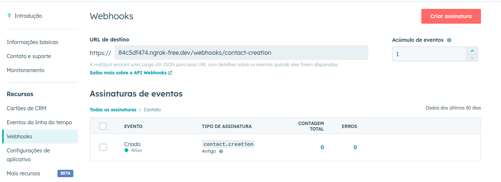

# Meetime - Teste Técnico

## Como Executar
1. Certifique-se de ter o **Java 17** instalado.
2. Clone este repositório.
3. Garanta que seu JAVA_HOME esteja com um sdk do java 17.
4. Crie um application.properties baseado no exemple.application.properties.
5. As seguintes variaveis de ambiente vão estar vazias, preencha elas com os valores encontrados no seu app do HubSpot.
```sh
    hubspot.client-id
    hubspot.client-secret
```
6. Execute os comandos:
```sh
   mvn clean install
   mvn spring-boot:run
   ```
7. A aplicação estará disponível em `http://localhost:8080`.
8. Para utilizar  webhook é necessário configurar o ngrok para expor o localhost:
```
Siga o passo-a-passo no link a seguir para configurar: https://ngrok.com/docs/getting-started/?os=linux
   
Após o ngrok estar rodando, uma tela com um formato parecido estará disponível: 

|--------------------------------------------------------------------------------------- | 
|Session Status                online                                                    |
|Account                       inconshreveable (Plan: Free)                              |
|Version                       3.0.0                                                     |
|Region                        United States (us)                                        |
|Latency                       78ms                                                      |
|Web Interface                 http://127.0.0.1:4040                                     |
|Forwarding                    https://84c5df474.ngrok-free.dev -> http://localhost:8080 |
|----------------------------------------------------------------------------------------|

Pegue o "Forwarding" e coloque ele na URL de destino na parte de Webhooks do seu app no HubSpot e adicione o caminho da rota "/webhooks/contact-creation"
   ```


## Endpoints
1. Geração da Authorization URL:
```
   http://localhost:8080/oauth/auth
   ```
2. Processamento do Callback OAuth: 
```
   http://localhost:8080/oauth/token?code=
   ```
3. Processamento do Refresh Token:
```
   http://localhost:8080/oauth/refresh-token?refreshToken=
   ```
4. Criação de Contatos:
```
   http://localhost:8080/contacts
   body: {
           "email": "example@example.com",
           "firstname": "teste",
           "lastname": "teste",
           "phone": "+123456789",
           "company": "Example Inc."
         }
   ```
5. Recebimento de Webhook para Criação de Contatos:
```
   http://localhost:8080/webhooks/contact-creation
   ```


## Tecnologias Utilizadas e Justificativa

### 📌 **Spring Boot**
- **spring-boot-starter-web**: Facilita a criação de aplicações RESTful, fornecendo suporte a servidores web embutidos.
- **spring-boot-starter-validation**: Fornece suporte à validação de dados via anotações como `@NotNull`, `@Size`, etc.
- **spring-boot-starter-test**: Biblioteca essencial para realizar testes unitários e de integração com JUnit e Mockito.
- **spring-boot-starter-aop**: Permite a implementação de Aspect-Oriented Programming (AOP) para manipulação avançada de lógica transacional, logging, etc.

### 🔐 **Spring Security**
- **spring-security-test**: Fornece ferramentas para testes de segurança em endpoints protegidos.

### 🔗 **Spring Cloud OpenFeign**
- **spring-cloud-starter-openfeign**: Simplifica a comunicação com APIs externas, permitindo a criação de clients declarativos baseados em interfaces.

### ⚡ **Resilience4j**
- **resilience4j-spring-boot3**: Implementa padrões de resiliência como o Rate Limiting.

### 🏗 **Lombok**
- **lombok**: Reduz a verbosidade do código ao eliminar a necessidade de escrever getters, setters e construtores manualmente.

### 📜 **Log4j**
- **log4j-api**: Biblioteca robusta para logging, proporcionando alto desempenho e flexibilidade na configuração dos logs.

### 🔄 **Gerenciamento de Dependências**
- **spring-cloud-dependencies**: Centraliza a versão das dependências do Spring Cloud, garantindo compatibilidade entre os módulos.

## Melhorias 
- Adicionar docker no projeto para simplicar o processo de execução.
- Utilizar Swagger para documentação da API.
- Adicionar suporte a batch operations de contatos.
